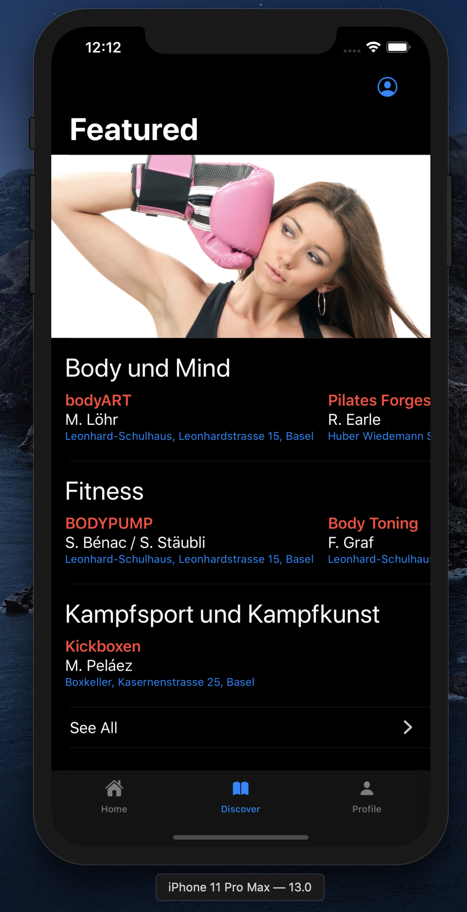
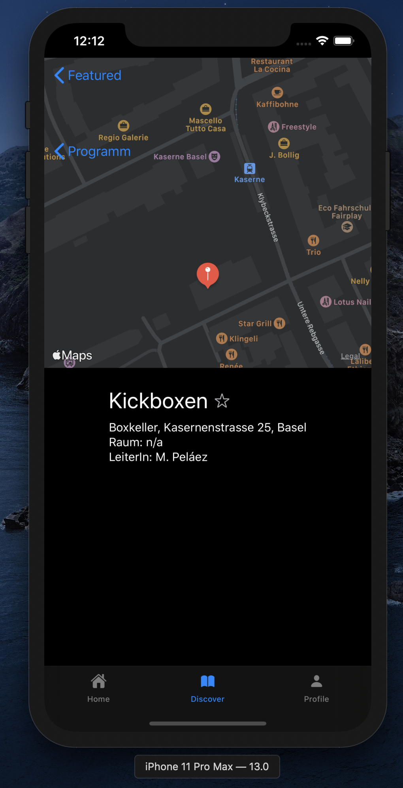

# UNI-SPORT-Basel

 

<b>BUILT DURING SWIFTUI BETA, could be using deprecated code</b>

A small example App featuring views within views, including Mapview.

Work in progress.

## Guide

As of 16.9.19, you still need
1. A paid apple developer account
2. MacOS 10.15 Catalina beta
3. XCode 11 GM
4. <i>(optional)</i> iOS 13 beta to preview on device

Clone and open in XCode
